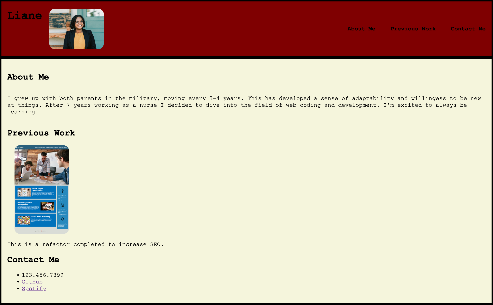

# Responsive Design Portfolio

## Description

This project was created as a central place to hold my future projects to present to potentiial employers. I learned how to utilize Advanced CSS attributes to add different stylings to my page. I also learned how to make webpages that are functional on different screen types using media queries and flexbox attributes.

## Usage

This page is simple but it has nav links that will take you to the corresponding sections. Upon clicking on the screenshot of my previous work it will also take you to that deployed application.

